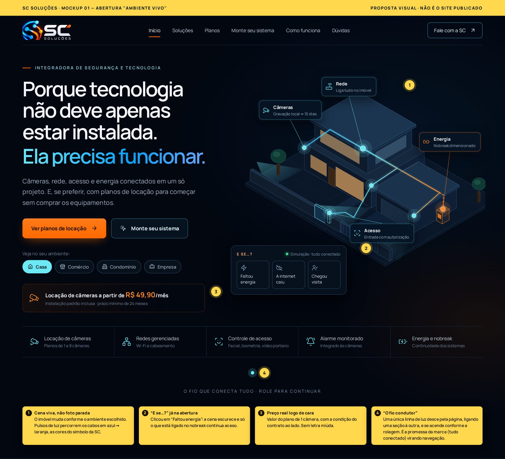
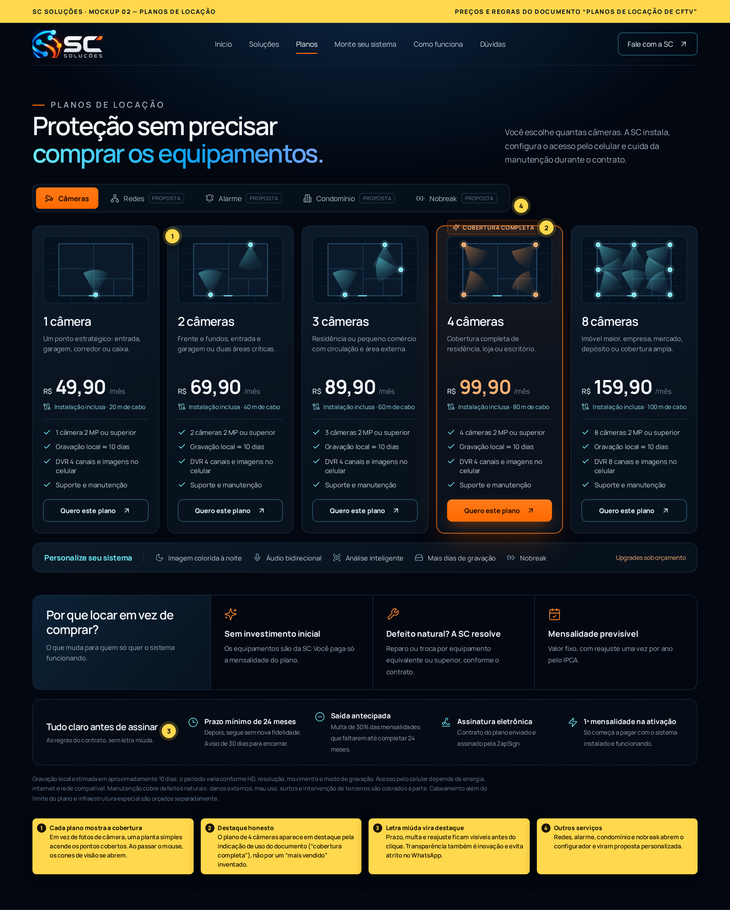
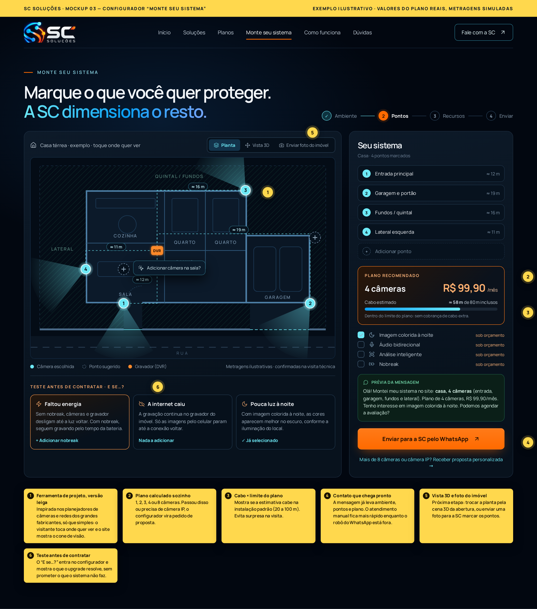
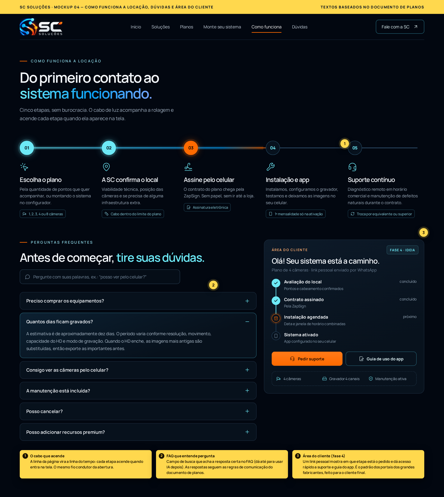
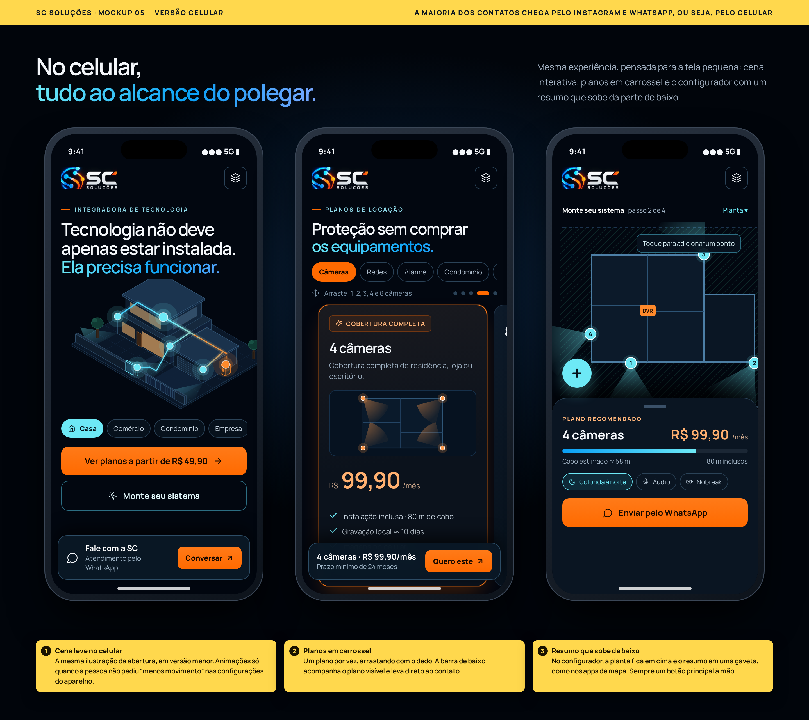

# Plano de inovação: site da SC Soluções

Proposta visual e de conteúdo para a nova versão de `somoscella.online`.
As imagens são **mockups** (desenhos de como ficaria), não o site publicado.
Os preços e as regras dos planos vêm do documento *Planos de Locação de CFTV*.

---

## A ideia central: tecnologia que se vê funcionando

O slogan da SC já diz tudo: *"Porque tecnologia não deve apenas estar instalada. Ela precisa funcionar."*
Hoje o site **fala** isso. A proposta é o site **mostrar** isso. O visitante segue um caminho em três passos:

1. **Ver**: uma cena viva do imóvel, com câmeras, rede, acesso e energia ligados por linhas de luz.
2. **Testar**: o "E se…?" mostra o que acontece se faltar energia, se a internet cair ou se chegar uma visita.
3. **Montar**: o configurador transforma o que a pessoa marcou em um plano com preço, e a mensagem chega pronta no WhatsApp.

## O que aproveitamos dos sites de referência

| Referência | O que eles fazem bem | Como vira inovação na SC |
|---|---|---|
| Hikvision e Dahua | Soluções organizadas por tipo de ambiente, com o ambiente em cena | **Cena viva** que muda entre casa, comércio, condomínio e empresa |
| Ubiquiti | Visual escuro e limpo, produto em destaque, ferramenta de projeto (Design Center) | **Configurador "Monte seu sistema"**, na versão para leigos |
| Intelbras | Linguagem próxima do consumidor brasileiro, suporte fácil de achar | **Planos com preço claro**, dúvidas frequentes diretas e **área do cliente** |

A SC não compete em catálogo com fabricantes. O diferencial é ser a **integradora que explica, dimensiona e cuida**, e o site precisa passar essa sensação.

---

## As 9 inovações

### 1. Abertura "Ambiente vivo" (mockup 01)

- Ilustração isométrica do imóvel no lugar da foto parada. Os pontos (câmeras, rede, acesso, energia) têm etiquetas, e pulsos de luz azul → laranja percorrem os cabos, nas cores do símbolo da SC.
- Botões de ambiente (Casa, Comércio, Condomínio, Empresa) trocam a cena.
- O primeiro número que o visitante vê é real: **locação a partir de R$ 49,90/mês**, com a condição do contrato ao lado.

### 2. "E se…?" na abertura e no configurador (mockups 01 e 03)
O site atual já tem um simulador de cenários (falta de energia, internet caída, visitante). A proposta é trazê-lo para a primeira dobra e para o configurador. Ao clicar em *Faltou energia*, a cena escurece e só o que está no nobreak continua aceso. Isso ensina e vende o upgrade **sem prometer o que o sistema não faz**.

### 3. Planos de locação transparentes (mockup 02)

- Cinco planos (1, 2, 3, 4 e 8 câmeras) com mensalidade, limite de cabo e uso indicado, tudo do documento.
- Em vez de foto de câmera, cada plano mostra uma **mini planta com os cones de visão**. Dá para entender a cobertura num olhar.
- O destaque do plano de 4 câmeras vem da indicação de uso do documento ("cobertura completa"), sem inventar "mais vendido".
- **"Tudo claro antes de assinar"**: prazo mínimo, multa, ZapSign e 1ª mensalidade na ativação ficam visíveis antes do clique.
- Abas para Redes, Alarme, Condomínio e Nobreak levam a uma proposta personalizada.

### 4. Configurador "Monte seu sistema" (mockup 03)

- A pessoa toca na planta onde quer ver, e o site desenha o cone de visão.
- O plano é calculado sozinho (1, 2, 3, 4 ou 8). Passou de 8 ou precisa de câmera IP, vira pedido de proposta.
- **Cabo estimado × limite do plano**: mostra se cabe na instalação padrão e evita surpresa na visita (metragem ilustrativa, confirmada na visita técnica).
- Recursos opcionais (imagem colorida à noite, áudio, análise inteligente, nobreak) aparecem sempre como **"sob orçamento"**.

### 5. Contato que chega pronto (mockup 03)
O botão final gera a mensagem do WhatsApp com ambiente, pontos, plano e interesses. Hoje o site já monta uma mensagem a partir das 4 perguntas; a proposta é enriquecê-la. Enquanto o robô do WhatsApp estiver fora, isso deixa o atendimento manual bem mais rápido.

### 6. O fio condutor (mockups 01 e 04)
Uma única linha de luz desce pela página e liga uma seção à outra. Na seção *Como funciona*, ela vira a linha do tempo e acende cada etapa quando aparece na tela. É a promessa da marca (tudo conectado) virando navegação.

### 7. Como funciona e dúvidas que entendem a pergunta (mockup 04)

- Cinco etapas da locação: escolher, confirmar o local, assinar pela ZapSign, instalar e configurar o app, suporte contínuo.
- Dúvidas frequentes com as respostas do documento e um campo de busca "pergunte com suas palavras". Dá para ligar uma IA depois, se fizer sentido.

### 8. Área do cliente (mockup 04, fase 4)
Um link pessoal, enviado pelo WhatsApp, mostra em que etapa está o pedido (avaliação, contrato, instalação, ativação), com botões de suporte e guia do app. É o que os grandes fabricantes oferecem, feito para o cliente final da SC.

### 9. Pensado primeiro para o celular (mockup 05)

A maior parte dos contatos vem do Instagram e do WhatsApp, ou seja, do celular. No celular:

- A cena da abertura vem em versão leve.
- Os planos ficam em carrossel, com uma barra fixa embaixo que segue o plano visível.
- O resumo do configurador sobe da parte de baixo da tela, como nos apps de mapa.

---

## Roteiro em fases

| Fase | O que entra | Por que nessa ordem | Esforço |
|---|---|---|---|
| **1. Planos no ar** | Seção de planos (02), preço na abertura, "Tudo claro antes de assinar", dúvidas do documento, botão do WhatsApp já com o plano | É o que mais gera contato e o conteúdo já está pronto no documento | Pequeno |
| **2. Experiência** | Cena viva por ambiente, "E se…?" na abertura, fio condutor, versão celular caprichada | Diferencia a SC de qualquer integradora da região | Médio |
| **3. Configurador** | "Monte seu sistema" com planta, cálculo do plano e mensagem pronta | Qualifica o contato antes da conversa | Médio/grande |
| **4. Relacionamento** | Área do cliente, busca inteligente nas dúvidas, vista 3D e envio de foto do imóvel | Precisa da operação de locação rodando | Grande |

## Regras que o novo site vai seguir

- **Nada inventado**: sem clientes, depoimentos, certificações, garantias ou números que não existam. Preços só do documento de planos.
- **Comunicação dos planos** (do próprio documento): "aproximadamente dez dias" de gravação, acesso pelo celular depende de energia e internet, câmera não "impede crime", upgrades não são item padrão, equipamentos são da SC durante a locação.
- **Logo oficial** sempre dos arquivos aprovados, nunca redesenhada.
- **Imagens**: fotos reais ou imagens de IA fornecidas pelo Kauan. As cenas ilustradas são desenho vetorial, identificado como exemplo.
- **Acessibilidade**: animações desligam para quem pede "menos movimento" no aparelho, e tudo funciona pelo teclado.

## Decisões que preciso de você

1. **Preço no site ou "sob consulta"?** Seus mockups usam "Sob consulta", mas o documento traz os valores e até o texto pronto para o site. Minha recomendação: **mostrar o preço**, porque é o maior diferencial frente à concorrência.
2. **Ilustração ou foto?** Minha recomendação: ilustração na abertura, nos planos e no configurador (explica melhor) e as fotos que você gerou nas páginas de ambiente e no Condomínio Evoluído (emocionam mais).
3. **Revisão jurídica**: o documento pede revisão dos contratos antes do uso definitivo. Os textos de condições no site devem acompanhar essa revisão.
4. **WhatsApp**: com o robô fora do ar, o contato cai no atendimento manual. Pode lançar assim?

## Como ver e editar os mockups

- Imagens prontas: pasta `imagens/`.
- Fonte dos mockups (HTML): pasta `mockups/`. Para gerar as imagens de novo: `cd docs/inovacao/mockups && node render.mjs` (precisa do Playwright instalado).
