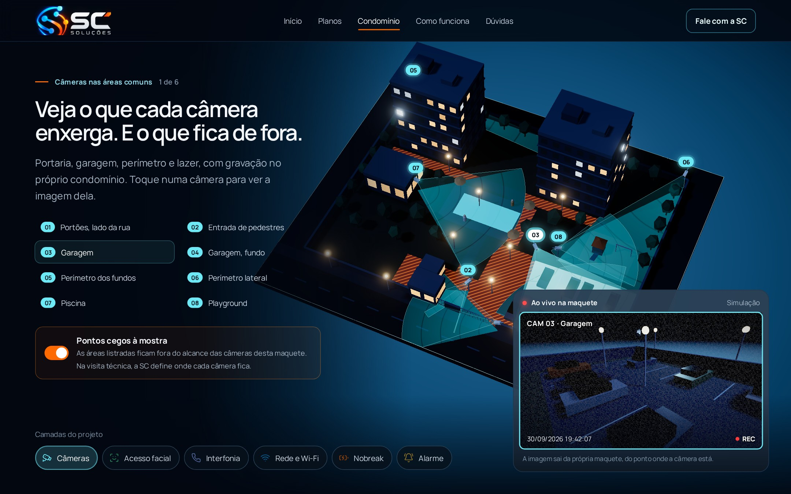
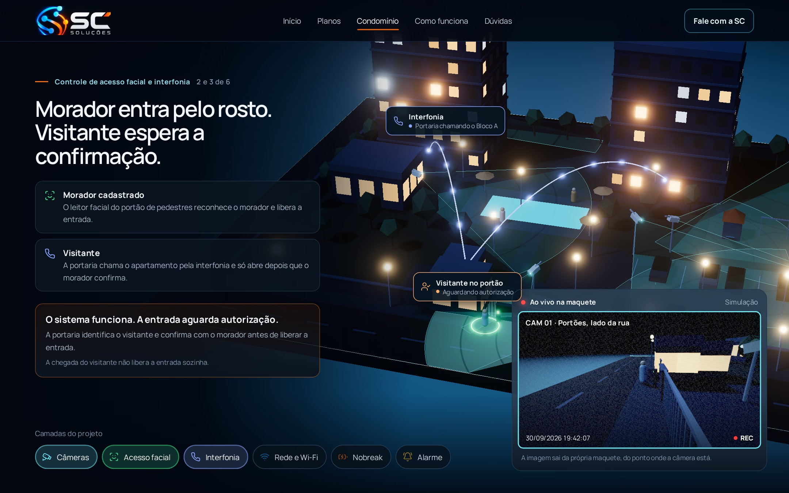
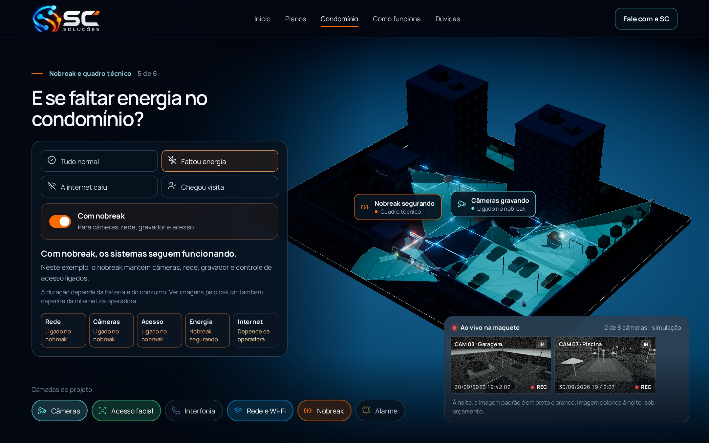
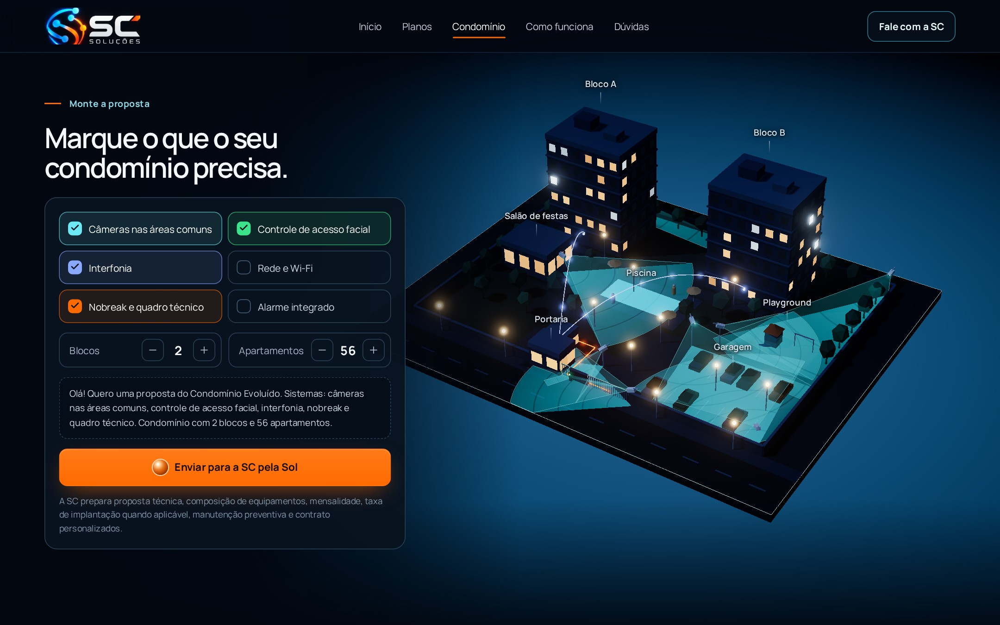
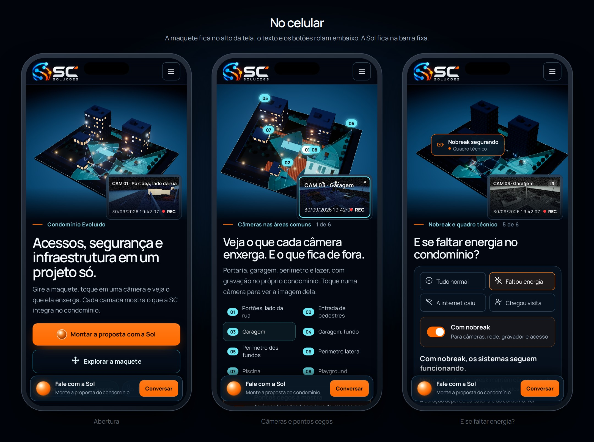
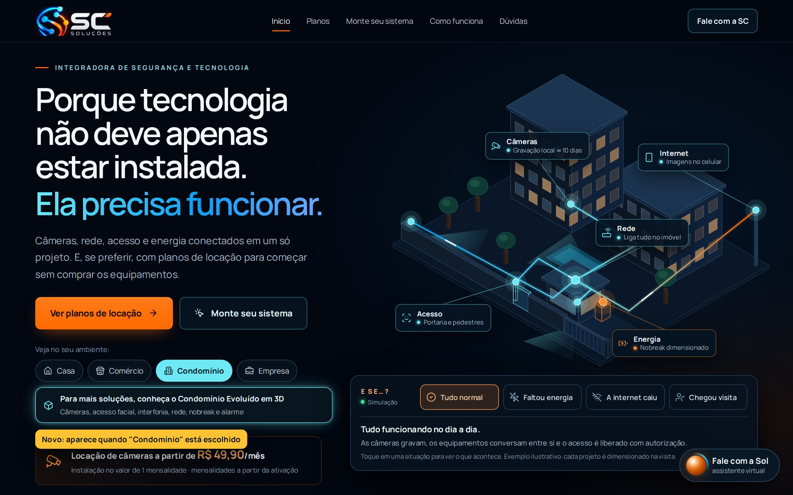

# Condomínio Evoluído em 3D: plano da página

**Situação (30/09/2026): aprovada pelo Kauan e construída** no ramo `claude/sweet-faraday-yvwddr`
(ainda **não publicada**). As imagens abaixo são as do protótipo aprovado (`mockups/`); as fotos da
página construída estão em `site-final/` e o lado a lado em `comparacao/`.

**Decisões do Kauan (30/09):** visual aprovado; "Condomínio" no menu principal; blocos e apartamentos
no formulário (opcionais); link na abertura (ao escolher "Condomínio"), na aba Condomínio dos planos e
no configurador.

**Diferenças em relação às imagens, e por quê:**

- As camadas ficaram dentro do painel do monitor. Na coluna da esquerda elas batiam no texto dos
  capítulos mais longos.
- O botão da abertura leva ao formulário "Monte a proposta", e é de lá que a Sol abre, já com os
  sistemas marcados.
- Interfonia e alarme ganharam capítulos próprios, completando os 6.
- O monitor fica um pouco mais alto, para não ficar embaixo do botão "Fale com a Sol".
- No "E se…?", ao tocar em "Faltou energia" o nobreak começa desligado, como na página inicial, e a
  pessoa liga para ver a diferença.

---

## A ideia: a maquete viva do condomínio

O visitante vê o condomínio de cima, como uma maquete iluminada à noite. Ele pode girar a maquete, tocar
numa câmera e ver **o que aquela câmera enxerga**. A imagem sai da própria maquete, em tempo real, com
cara de câmera de segurança (nome, data, hora e REC).

Cada sistema do **Condomínio Evoluído** é uma camada que acende:

| Camada | Cor | O que aparece na maquete |
|---|---|---|
| Câmeras nas áreas comuns | ciano | câmeras, campo de visão no chão e os **pontos cegos** |
| Controle de acesso facial | verde | leitor facial no portão de pedestres, portões |
| Interfonia | lilás | ligação da portaria com os blocos |
| Rede e Wi-Fi | azul | cabos até o quadro técnico, pontos de Wi-Fi nas áreas comuns |
| Nobreak e quadro técnico | laranja | nobreak e rack; o que continua ligado quando falta energia |
| Alarme integrado | âmbar | sensores no muro e a zona do perímetro |

**Por que assim:**

- A SC vende integração, e a maquete mostra a integração funcionando, com tudo ligado num projeto só.
  É o próprio texto do documento: *"Acessos, segurança e infraestrutura em um projeto só."*
- **Pontos cegos** explicam, sem discurso, por que a visita técnica importa.
- Não depende de fotos (ainda não temos), e não finge ser foto: é uma maquete, identificada como
  ilustrativa.
- Continua a linguagem da abertura do site (prédios azul-noite, janelas quentes, linhas de luz), agora
  com profundidade.

## Como fica

**1. Abertura.** Maquete com câmeras, rede, energia, interfonia e acesso. O "monitor" mostra 4 câmeras
ao vivo, e o botão principal abre a Sol para montar a proposta.


**2. Câmeras e pontos cegos.** Cada câmera tem um número. Tocar nela (ou no nome, na lista) mostra a
imagem grande. As listras laranja são áreas de circulação que nenhuma câmera desta maquete vê.


**3. Acesso facial e interfonia.** O visitante chega ao portão, a portaria chama o apartamento e a
entrada espera a confirmação. A câmera da rua mostra o visitante. Os textos são os mesmos do "E se…?"
da página inicial.


**4. E se faltar energia?** A maquete apaga, e com nobreak câmeras, rede, gravador e acesso seguem
ligados. As câmeras passam para a imagem noturna em preto e branco (colorida à noite é sob orçamento).


**5. Monte a proposta.** O visitante marca os sistemas, e a maquete acende só o que foi marcado. A
mensagem vai pronta para a Sol, que já faz a captura do contato como no resto do site.


**6. No celular.** A maquete fica no alto da tela e o texto rola embaixo. A imagem da câmera flutua
no canto, e a Sol fica na barra fixa.


**7. O link na página inicial.** Quando o visitante escolhe "Condomínio" na abertura, aparece o
convite para a página nova. O selo amarelo só marca a novidade na imagem; ele não vai para o site.


## O roteiro da página

A página é uma história em capítulos. Ao rolar, a maquete voa até o ponto certo e acende a camada do
capítulo. Quem quiser pode sair do roteiro e explorar à vontade.

| # | Capítulo | O que a maquete faz | De onde vem o texto |
|---|---|---|---|
| — | Abertura | visão geral, monitor com 4 câmeras | `servicosProposta` (Condomínio Evoluído) |
| 1 | Câmeras nas áreas comuns | campos de visão, pontos cegos, lista das câmeras | `sistemasCondominio` |
| 2 | Controle de acesso facial | leitor facial, visitante no portão | `ambientes` (condomínio) e `estadoCena('condominio', 'visita')` |
| 3 | Interfonia | portaria chamando os blocos | `sistemasCondominio` |
| 4 | Rede e Wi-Fi | cabos até o quadro, Wi-Fi e portal para visitantes | `servicosProposta` (redes) |
| 5 | Nobreak e quadro técnico | "E se…?": energia, internet, visita | `estadoCena('condominio', …)` |
| 6 | Alarme integrado | sensores e perímetro; avisos no aplicativo | `servicosProposta` (alarme monitorado pelo app) |
| — | Monte a proposta | acende só o que foi marcado; mensagem para a Sol | `sistemasCondominio`, `textoProposta` |
| — | Fale com a SC | a mesma seção da inicial, com o WhatsApp | `contato` |

## Regras que a página segue

- **Nada inventado.** Os textos saem de `dados.ts`, `cenarios.ts` e `configurador-dados.ts`, os
  mesmos da página inicial. A maquete é um exemplo, e isso fica escrito na tela. Não mostramos
  "porcentagem de cobertura" nem números que não existam.
- **Condomínio é proposta personalizada.** Não há preço nem condição contratual nesta página.
- **WhatsApp só em "Fale com a SC".** Os botões de proposta abrem a Sol (orbe laranja), com a
  mensagem pronta. Sem JavaScript, eles levam a `#contato`.
- **Gravação:** "gravação no próprio condomínio", sem prometer dias; o tempo é dimensionado no
  projeto. **Imagem noturna** padrão em preto e branco, e colorida à noite sob orçamento.
- **Privacidade igual à de hoje:** sem cookies e sem rastreamento, com o Three.js servido pelo
  próprio site (o protótipo usa a jsDelivr só para as imagens de teste). A política de privacidade não
  muda.

## Arquitetura (parte técnica)

**Página:** `site/src/pages/condominio.astro` gera `/condominio/`. É HTML estático com todo o texto
dos capítulos, então funciona sem JavaScript, é lida pelo Google e acessível. O 3D entra por cima.

**Motor 3D:** [Three.js](https://threejs.org) r186 (WebGL 2). É o padrão de mercado para 3D no
navegador, com muita documentação, estável e sem dono comercial.

| Alternativa | Por que não |
|---|---|
| Spline | Motor pesado, cenas hospedadas fora do site, pouco controle sobre o que é desenhado |
| Babylon.js | Mais completo do que precisamos e mais pesado |
| Vídeo ou sequência de imagens | Bonito, mas não dá para tocar na câmera nem girar |
| Modelo feito no Blender (glTF) | Precisa de modelagem manual a cada mudança; o nosso sai do código |

**Modelo sem arquivo 3D:** a maquete é gerada a partir de dados (lote, prédios, câmeras e camadas).
Mudar uma câmera de lugar é mudar um número. Nada de modelagem nem de download de modelo.

```
src/lib/condominio/          regras sem DOM, com testes (Vitest)
  maquete.ts                 lote, prédios, áreas, câmeras (posição, direção, abertura, alcance)
  cobertura.ts               campo de visão de cada câmera e pontos cegos (geometria 2D)
  capitulos.ts               capítulos, câmera de cada capítulo, camadas acesas, textos (de dados.ts)
  proposta.ts                mensagem para a Sol (sistemas, blocos, apartamentos)
src/scripts/condominio/      só o navegador
  cena.ts                    monta a maquete no Three.js a partir de maquete.ts
  monitor.ts                 imagens das câmeras (render em textura, efeito de câmera de segurança)
  roteiro.ts                 capítulos por rolagem, voo da câmera, modo "explorar"
src/components/condominio/   HTML dos capítulos, monitor, camadas, formulário
```

**Carregamento em duas partes.** A página abre com HTML, texto e uma **imagem pronta da maquete**
(gerada por script, igual às imagens deste plano). O Three.js só é baixado depois e troca a imagem pela
maquete viva, sem pular nada na tela.

| Orçamento | Meta | Referência |
|---|---|---|
| Primeira visão (antes do 3D) | até 300 KB | a inicial hoje tem 386 KB |
| Parte 3D, baixada depois | até 700 KB (cerca de 200 KB compactados) | medido: Three.js com o que usamos = 604 KB (152 KB compactados) |
| Fluidez | 60 quadros/s no computador, 30 ou mais em celular intermediário | |

**Cuidados de desempenho:** desenha só quando algo muda, pausa fora da tela e com a aba escondida,
reduz a qualidade em celular fraco (menos brilho e sombra) e usa um canvas só para maquete e monitor.

**Sem 3D, a página continua completa.** Isso vale sem WebGL, com economia de dados ou sem
JavaScript: fica a imagem da maquete e todo o texto, e os botões funcionam.

**Acessibilidade:**

- Tudo o que se faz na maquete também se faz por botões (a lista das câmeras e as camadas), inclusive
  pelo teclado.
- Com "reduzir movimento", os voos da câmera viram cortes secos.
- O axe precisa dar 0 violações.
- O canvas tem descrição para leitor de tela.

**Base multipágina:**

- O `Base.astro` passa a carregar só o que é comum.
- Cada página leva os próprios estilos e scripts, então a inicial não fica mais pesada.
- Cabeçalho e rodapé funcionam fora da inicial (`/#planos`).
- A Sol e o "Fale com a SC" são reaproveitados.

## Etapas

Um commit por etapa, e cada uma só passa com o validador todo ✅.

| Etapa | O que entra | Pronto quando |
|---|---|---|
| 0. Base multipágina | Layout enxuto, links entre páginas, Sol e "Fale com a SC" reutilizáveis | a inicial idêntica, 82/82 ✅ |
| 1. Regras e dados | `maquete.ts`, `cobertura.ts`, `capitulos.ts`, `proposta.ts` | testes: toda câmera dentro do lote, pontos cegos corretos, mensagem da Sol |
| 2. Página sem 3D | `/condominio/` com todo o texto, imagem da maquete, Sol, `#contato` e os links na inicial | funciona sem JavaScript; sitemap e axe ✅ |
| 3. Maquete 3D | modelo, luz, materiais, rótulos e a troca da imagem pela maquete | 3D desenha, sem erros; sem WebGL cai na imagem |
| 4. Roteiro por rolagem | capítulos movem a câmera e acendem as camadas | cada capítulo no enquadramento certo; "reduzir movimento" ✅ |
| 5. Interações | monitor ao vivo, tocar na câmera, pontos cegos, "E se…?", explorar | tudo também pelo teclado |
| 6. Celular e desempenho | layout, toque, gestos, qualidade automática | orçamento de peso e fluidez ✅ |
| 7. Validação e fotos | conferências novas, fotos e lado a lado com estas imagens | checklist completa |

**Conferências novas no validador:**

- A maquete desenha de verdade (pixels na tela) e sem erros.
- Os capítulos trocam o enquadramento e as camadas.
- A câmera escolhida aparece no monitor, também pelo teclado.
- Sem WebGL, fica a imagem e o texto.
- Com "reduzir movimento", nada anima sozinho.
- Nenhum WhatsApp fora de `#contato`, e o botão de proposta abre a Sol com os sistemas marcados.
- Peso dentro do orçamento, axe sem violações e a página no sitemap.

## Decisões que preciso de você

1. **O visual está aprovado?** Pode pedir ajustes nas imagens antes de eu construir, como cores,
   quantidade de prédios, texto dos títulos ou ordem dos capítulos.
2. **"Condomínio" no menu principal?** Recomendo que sim, como nas imagens: é a porta de entrada da
   página.
3. **Blocos e apartamentos no formulário?** Ajudam a equipe a dimensionar (as imagens mostram 2 blocos
   e 56 apartamentos só como exemplo). São opcionais para o visitante.
4. **Onde entra o link na inicial?** Recomendo três lugares: na abertura quando "Condomínio" está
   escolhido (imagem 7), na aba "Condomínio" dos planos e no configurador quando o ambiente é
   condomínio.
5. **Fotos reais:** quando existirem, entram na página como "Instalações da SC", abaixo da maquete. A
   maquete não depende delas.

## Como gerar as imagens de novo

```bash
cd site
npm install --no-save three@0.186.1   # o protótipo usa o Three.js do disco
npm run build                         # só para a imagem 7 (usa o site gerado)
node ../docs/inovacao/condominio/mockups/render.mjs          # todas
node ../docs/inovacao/condominio/mockups/render.mjs cameras  # só uma: geral, cameras, acesso, energia, projeto, celular, inicial
```

O protótipo (`mockups/maquete.js` e `pagina.html`) também abre no navegador, servido por qualquer
servidor local, com internet para baixar o Three.js (por exemplo, `pagina.html?estado=cameras`). Ele
serve de referência visual. O código da página vai ser escrito em TypeScript dentro do site, com testes.
